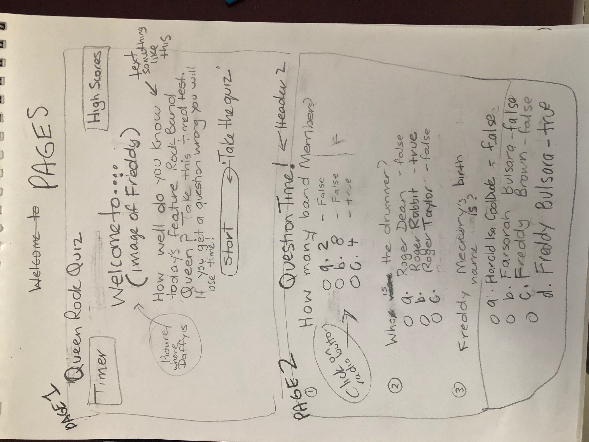
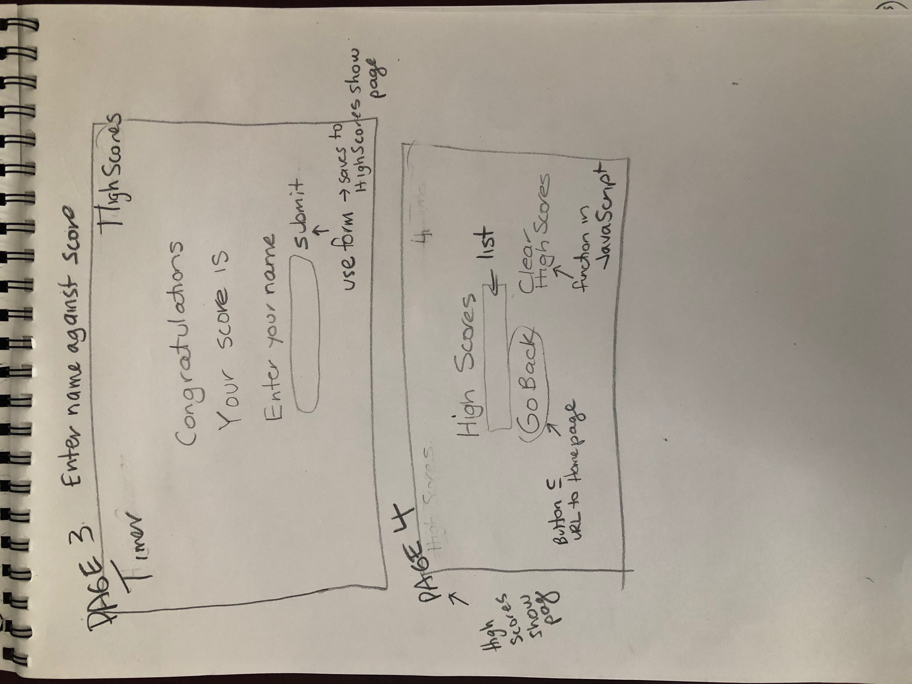
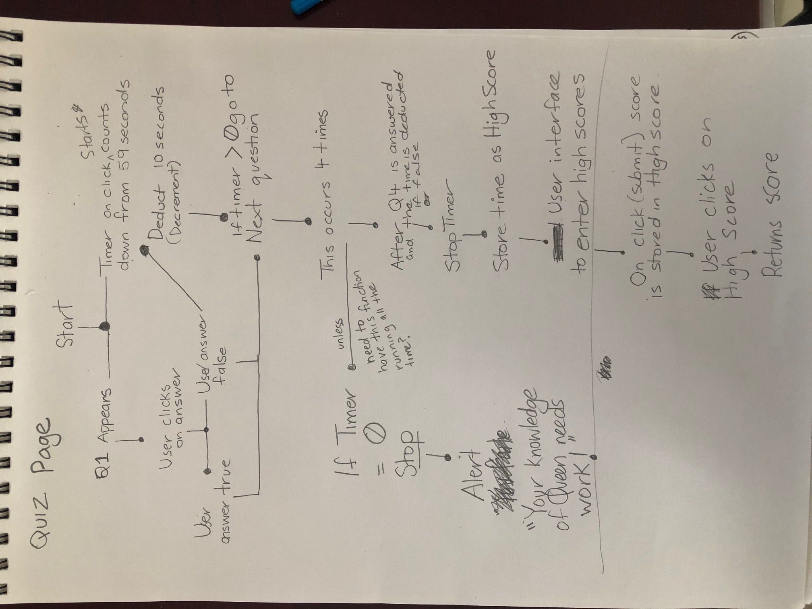
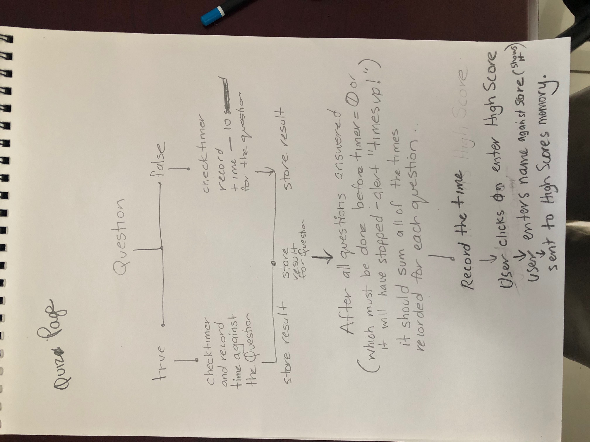
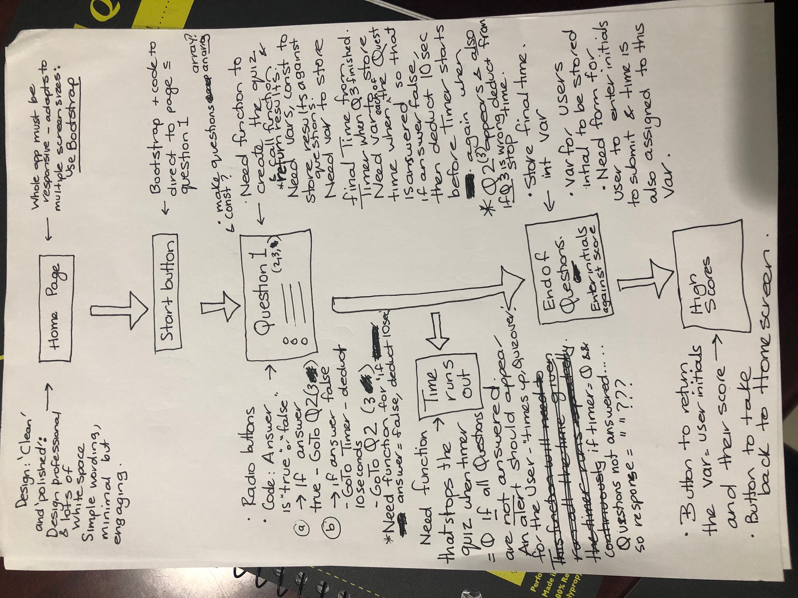

CODE QUIZ

STARTING POINT
I have decided to use the previous homework in week 2 - being Bootstrap - as the base html for my homepage for the quiz. 
I did this because it has the containers and is responsive to multiple screen sizes, so I did not have to reinvent the wheel.
I have managed to change this to work - being:
A home page introducing the quiz, that has buttons that link to the high scores and quiz pages.
I think that this might not be the way to do it but just want to show I understand the steps as per my flow chart/pseudo code.
The pseudo code/flow chart is in multiple jpg files:

If the above doesnt work......
pseudo1pages.jpg at https://github.com/MagsBootCamp/homework04-quiz/blob/master/pseudo1pages.jpg
pseudo2pages.jpg at https://github.com/MagsBootCamp/homework04-quiz/blob/master/pseudo2pages.jpg
pseudo3quizflow.jpg at https://github.com/MagsBootCamp/homework04-quiz/blob/master/pseudo3quizflow.jpg
pseudo4quizflowmore.jpg at https://github.com/MagsBootCamp/homework04-quiz/blob/master/pseudo4quizflowmore.jpg
pseudosummaryofneeds.jpg at: https://github.com/MagsBootCamp/homework04-quiz/blob/master/pseudo5summaryofneeds.jpg

THE PROCESS OF ATTEMPTING TO CREATE THE QUIZ
I dont think I'm doing this the right way but trying to show that I undestand what needs to be done albeit I am struggling to put it all together.
I decided to Google timers and also quizzes to get some help. I have acknowledged this in the Java Script file.
Theres quite a few test files "Kwiz" in Git Hub as I thought it best to try various options first.

